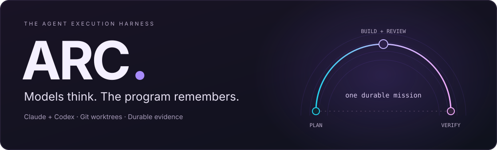
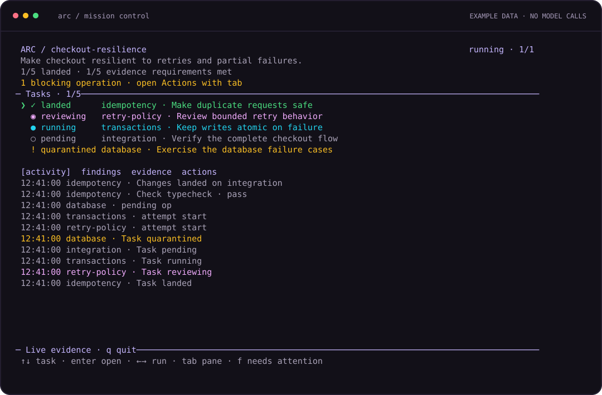
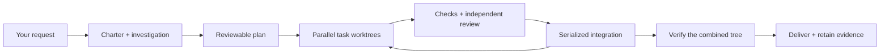

<p align="center">
  
</p>

<p align="center">
  <strong>Give coding agents a mission.<br/>Keep the goal, the work, and the evidence together.</strong>
</p>

<p align="center">
  <a href="https://github.com/Zie619/Arc/actions/workflows/ci.yml"></a>
  <a href="LICENSE"></a>
  
  
  
</p>

<p align="center">
  <a href="#get-started">Get started</a> ·
  <a href="#your-mission-control">The interface</a> ·
  <a href="#how-a-mission-runs">How it works</a> ·
  <a href="docs/security.md">Security</a> ·
  <a href="docs/purpose.md">Why ARC exists</a>
</p>

---

ARC is a terminal harness for **Claude and Codex working on the same coding mission**.
It turns a request into bounded tasks, runs eligible work in parallel, and requires
checks and independent review before accepting the result.

The conversations can end. The mission should survive.

| You want… | ARC provides… |
| :--- | :--- |
| A large request that stays on track | A durable charter, explicit decisions, and fresh briefs for every dispatch |
| Several agents without checkout collisions | Separate Git worktrees, dependency scheduling, and serialized integration |
| A result you can inspect | Acceptance evidence, gate receipts, review findings, and a final check of the combined tree |
| A useful answer after an interrupted run | Preserved work, resumable deep missions, and a digest of what needs attention |

## Your mission control

<p align="center">
  
  <br/>
  <sub>Rendered from ARC's actual terminal components with example mission data. No model calls.</sub>
</p>

Start with a conversation. Open **`/dashboard`** whenever you want the operational view.

- **See what needs you.** Blocking operations and quarantined tasks appear before the activity log.
- **Open a task.** Inspect attempts, transcripts, checks, findings, and acceptance evidence.
- **Review before building.** Browse every planned task, its dependencies, affected files, and actual proof commands.
- **Keep working comfortably.** Long drafts scroll around the cursor. Command menus keep the selection visible. Layouts respond to terminal resizing.
- **Return to the conversation.** Closing the dashboard leaves the mission running.

```text
/lane                 Choose a workflow with the arrow keys
/dashboard            Open live tasks, evidence, and actions
/digest               What happened? What needs me next?
/why retry-policy     Explain one task's failure
/ops                  List pending operator actions
/resume RUN_ID        Continue a saved deep mission
/model                Choose models and effort per role
```

**Keyboard:** `Enter` sends · `Shift+Enter` adds a line · `/` opens commands ·
`Esc` stops active work · `Shift+Tab` changes approval mode.
Inside the dashboard, `↑↓` selects tasks, `Enter` opens one, `Tab` switches panes,
`PgUp/PgDn` scrolls evidence, and `f` filters tasks needing attention.

[Full interface guide →](docs/interface.md)

## Get started

You need **Node.js 24+**, **pnpm**, **Git**, and installed, logged-in **Claude Code**
and **Codex CLI**. ARC drives those CLIs through your existing accounts.

```sh
git clone https://github.com/Zie619/Arc.git
cd Arc
pnpm install --frozen-lockfile

# A shortcut for this terminal session.
ARC_CLI="$PWD/src/cli.ts"
arc() { node "$ARC_CLI" "$@"; }

# Check installed CLI capabilities. No model turn is spent.
arc doctor
```

Then, in the same terminal, choose a repository:

```sh
cd /path/to/your-project
arc init
```

Inspect the generated `arc.yaml`. Set the delivery strategy for your first mission
and confirm that its gates are your real test and typecheck commands:

```yaml
landStrategy: none       # Keep verified work on an integration branch to inspect.
sandboxPolicy: refuse   # Skip read-only checks when OS containment is unavailable.
```

Launch ARC and describe a small, concrete outcome:

```sh
arc
```

> Add duplicate-request handling to the checkout endpoint. Preserve the public
> response shape and prove that retries cannot create a second order.

Choose `/lane deep` for an isolated, resumable mission. Read the proposed tasks and
checks before approving the build. Start small, establish that setup and gates work
in fresh worktrees, then expand the scope.

[First-run walkthrough](docs/getting-started.md) · [Configuration reference](docs/configuration.md)

## One interface, several workflows

Use **`/lane`** to choose, or let ARC route each request automatically.

| Workflow | Best for | Where the result goes |
| :--- | :--- | :--- |
| **Direct** | A focused change with checks and independent review | Uncommitted changes in your current checkout |
| **Deep** | A larger mission with dependent tasks and multiple workers | Isolated worktrees → integration branch → configured delivery |
| **Research** | Understanding a repository or investigating a question | Findings and an evidence-backed synthesis |
| **Review** | Checking changes already in your checkout | Review findings and executed checks |
| **Plan** | Clarifying requirements and designing the work | An inspectable plan, without implementation |

Workflow and approval mode are separate controls:

| Mode | Questions | Approval before implementation |
| :--- | :--- | :--- |
| **Asks first** | Asks you | Required |
| **Auto** | Takes recommendations | Required |
| **Danger** | Takes recommendations | Skipped |
| **Plan only** | Asks you | Stops before implementation |

`/lane auto` restores automatic workflow selection. `/new` starts a durable thread;
`/steer <note>` records guidance for the next dispatch. Queued follow-ups run when
the current work finishes; `/queue clear` removes them.

## How a mission runs



**The planner makes dependencies explicit.** Tasks declare affected paths,
contracts, and acceptance criteria. The scheduler admits eligible work when a
worker becomes free.

**Each accepted change needs evidence.** Implementation and review are separate
dispatches. Project gates and command criteria execute against the code. New
implementation attempts invalidate earlier proof; the historical receipts remain.

**The combined result gets checked again.** Passing branches can still conflict.
ARC re-runs configured gates and landed tasks' command criteria on the final
integration tree before delivery.

**The program remembers.** SQLite stores plans, attempts, decisions, and evidence
references. Artifacts preserve transcripts and outputs. Fresh agent briefs are
rebuilt from that record, keeping the original charter intact.

<details>
<summary><strong>What “done” means</strong></summary>

A task can be **landed** without the mission being **delivered**. A model's claim
is distinct from a command result, and a human waiver remains labeled as a waiver.

Deep missions deliver according to `landStrategy`:

- `none` keeps the verified result local on the integration branch.
- `pr` attempts to push the branch and open a pull request.
- `push` attempts to merge and push to the configured main branch.

A failed delivery leaves the run incomplete. The dashboard reports recorded
state; it does not turn a green task count into a delivery claim.

</details>

## Step away. Come back with context.

For a saved plan, the supervisor can keep a deep mission running through crashes:

```sh
arc run plan.yaml --until-done

# Inspect from another terminal.
arc ui --id RUN_ID
arc digest --id RUN_ID
arc why TASK_ID --id RUN_ID
```

The supervisor prevents sleep on macOS, relaunches through resume, and stops
repeated crashes that make no progress. Failed tasks preserve their worktrees for
inspection. Retry and capacity budgets stay with the run.

When ARC needs an external action, complete it and record what you did:

```text
/ops
/ops resolve OP_ID Started the test database and verified connectivity
/resume RUN_ID
```

Resolution records your note. It never executes the operation description.
For scripts, use `arc ops resolve OP_ID --id RUN_ID --note "what you completed"`,
then `arc resume --id RUN_ID --until-done`.

[Unattended execution and recovery →](docs/unattended.md)

## Deliberate boundaries

ARC is an **alpha for trusted local repositories**. Its checks improve execution
discipline; they do not make agent code infallible.

| Boundary | Current behavior |
| :--- | :--- |
| Repository isolation | Deep tasks use worktrees. Git metadata is shared. Dependencies, hooks, and approved commands carry real authority. |
| Provider execution | Codex uses its sandbox controls. Claude uses tool permissions and a minimized environment; ARC does not give it an OS sandbox. |
| Read-only reproduction | macOS checks get private scratch space, denied outside writes, and denied network access. Without a usable OS sandbox, they are skipped by default and stay unverified. |
| Environment access | Child environments are minimized. Additional environment variables and capability grants must be explicit. |
| Reliability evidence | Deterministic tests and adversarial benchmarks exercise the harness with fake providers. Live model quality and prolonged unattended operation need separate validation. |

**Direct edits have checkpoints and locking; deep missions add isolated branches
and crash recovery.** Choose the workflow that matches the work.

[Security model](docs/security.md) · [Execution audit](docs/2026-09-05-audit.md)

## Built to be inspectable

TypeScript. React + Ink. Built-in SQLite. **Four runtime dependencies.**

```sh
pnpm typecheck
pnpm test           # Includes terminal paint and interaction assertions.
pnpm bench          # Deterministic adversarial scenarios; no model calls.
pnpm docs:check
pnpm ui:preview     # Explore the real dashboard with example data.
```

`pnpm ui:preview --plan` opens a sample approval screen.
`pnpm docs:ui` regenerates the dashboard image from the actual interface.

| Read more | |
| :--- | :--- |
| [Why ARC exists](docs/purpose.md) | The original need, past-session lessons, and influences |
| [Interface guide](docs/interface.md) | Navigation, decisions, queueing, and recovery |
| [Configuration](docs/configuration.md) | Generated schema and defaults |
| [Contributing](CONTRIBUTING.md) | Tests, safety invariants, and development workflow |

ARC draws on ideas from **outsourcerer**, **open-kritt**, and **session-master**:
process supervision, structured review evidence, and explicit execution policy.
[The lineage →](docs/purpose.md#where-the-ideas-came-from)

---

<p align="center"><strong>A clear goal in. Inspectable work out.</strong><br/><sub>MIT licensed · Built for the terminal</sub></p>
