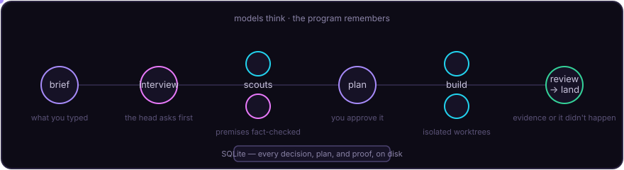

<p align="center">
  
</p>

<h1 align="center">arc</h1>

<p align="center"><b>A terminal orchestrator for AI coding agents.<br/>Models think. The program remembers.</b></p>

<p align="center">
  <a href="https://github.com/Zie619/Arc/actions/workflows/ci.yml"></a>
  
  = 22.5" />
  
  
</p>

<p align="center">
  
</p>

---

Arc looks like a single AI assistant in your terminal. Underneath, it runs a **team**: a strong model plans and asks you the right questions, a different model writes the code, and a third — never the author — reviews it. Your project's own tests actually run. Nothing counts as done without evidence on disk.

It exists because of a measurement, not a vibe:

| session | duration | compactions | outcome |
|---|---:|---:|---|
| A | 60h | 2 | lost the plot |
| B | 53h | 2 | lost the plot |
| C | 4.6h | 0 | held fine |

Long agent sessions don't get lazy — they **forget** when their context gets compacted. So Arc refuses to let any model be the memory:

> Every goal, decision, plan, task, and proof lives in SQLite and files on your disk.
> Every model call is short, single-purpose, and rebuilt fresh from those rows.
> An agent can crash, be killed, or be swapped for a newer model mid-mission — nothing is forgotten.

We proved it the direct way: `kill -9` mid-build, then `arc resume` — the stranded tasks were reclaimed, rebuilt, reviewed, and landed.

<p align="center">
  
</p>

## What talking to it feels like

Just type. A fast triage model routes every message to a **lane**:

| you type… | lane | what happens |
|---|---|---|
| `hey` | chat | instant reply, zero cost |
| `fix the null crash in slugify` | **direct** | one writer edits your checkout · tests run · independent review · minutes |
| `how does auth work here?` | **research** | read-only scouts investigate · synthesis with file:line evidence |
| `should we migrate to X?` | **plan** | interview → scouts → a plan · nothing is built |
| `check my working changes` | **review** | your diff reviewed against a clean base · nothing touched |
| a big messy mission | **deep** | the full machine below |

Pin a thread with `/lane direct` (or hand routing back with `/lane auto`). **shift+tab** cycles trust: *asks first* → *auto* → *plan only* → *danger*.

## The deep lane — missions that used to die in long chats

1. **Interview.** A deliberately repo-blind head extracts every buried question from your brief and asks you — with recommendations you can accept by pressing Enter.
2. **Premise check.** Scouts (a mix of both model families, because they notice different things) read the real code and **fact-check your brief's assumptions**. A refuted premise reopens the interview with the evidence — instead of poisoning the plan.
3. **Plan.** Tasks with declared file footprints and acceptance criteria, each naming its own proof command. You approve it.
4. **Build.** Writers work in parallel, each in an isolated git worktree — never in your checkout. Overlapping footprints and shared contracts are serialized automatically.
5. **Verify.** Your project's own tests and typecheck run in each worktree. The reviewer predicts risks *before* seeing the diff (it works from a tree where the diff doesn't exist), then reviews it. Its findings are re-executed as commands — in a deny-write sandbox.
6. **Land.** Verified tasks land one at a time on an integration branch, re-gated after every rebase. A final whole-branch review hunts cross-task contradictions. Your `main` is untouched until you merge.

## The paranoia layer

Agents say "done" when they aren't. Arc never takes their word:

- A task is done only when **evidence artifacts** exist — executed proof commands, gate outputs, review verdicts. Claims without artifacts are recorded as claims.
- *"No change needed"* is **rejected** if the worktree holds commits — a false no-op cannot silently abandon work.
- The model that actually ran is verified against the one you asked for. An `opus-4` quietly substituting for `opus-5` is caught as **model drift** and blocked. There is no fallback-model flag, ever — a silent downgrade is exactly what verification exists to expose.
- Agents get a **minimal, allowlisted environment** — never your shell's credentials. So do gates. So do reviewer-authored check commands, which additionally run read-only sandboxed (macOS).
- Before any direct edit, your checkout is **snapshotted** (patches, hashes, untracked inventory) and your pre-existing changes become protected paths. Arc detects violations and never "fixes" them with destructive recovery.
- Crashed? `arc resume` recomputes everything from the database. Cancelled? One `esc` kills the whole process tree in ~300ms.

## Quick start

```bash
# prerequisites: node >= 22.5, pnpm, git,
# plus the two agent CLIs, logged in: claude and codex

git clone https://github.com/Zie619/Arc.git && cd Arc
pnpm install
pnpm test                      # 333 tests, no tokens spent — agents are faked

# point it at any repo
cd ~/your/project
node /path/to/Arc/src/cli.ts go        # or link it: npm link / alias arc=...
```

Arc auto-detects your repo, main branch, and test/build scripts. No config file needed to start; `arc init` writes an `arc.yaml` you can tune. `arc doctor` probes your installed CLIs without spending a model call.

## The cast

| role | default | job |
|---|---|---|
| head | claude / opus | interviews you, assigns scouts, plans, synthesizes |
| triage | claude / haiku | routes what you typed, in a second or two |
| scout | codex / gpt-5.6-sol | read-only investigation |
| implement | codex / gpt-5.6-sol | writes the code |
| review | claude / opus | predicts risks blind, then reviews — never the author |
| integrate | claude / opus | whole-branch review before anything is called complete |

`/model` opens an arrow-driven picker (role → model → effort). Prefer aliases like `opus` — a new model generation ships and you're on it with zero changes. Personal overrides live in your own settings, never in the repo's config.

## Receipts, always

```
/status       tasks, live agents, and proof state
/criteria     every promise and whether it is actually proven
/findings     what the reviewers caught, with evidence
/transcript   the exact conversation of any agent dispatch
/usage        exact provider-reported token receipts
/limits       real subscription-window headroom (read from provider data, never invented)
```

Every provider call can be reconstructed from disk. If Arc can't measure something honestly, it says so instead of showing a number.

## Built by itself

The last several features in this repo — including the premise-reopen flow, the stall watchdog, and capability-gated provider flags — were **built by Arc running on its own repository**: one model as head and reviewer, the other writing. Its scouts refuted its operator's specs five times (correctly, every time), its integration reviewer blocked a cross-task design contradiction, and its failures surfaced engine bugs that are now regression-tested. The commit history is the receipt.

## Honest limits

- Alpha. One heavy dogfooding campaign, not years of daily use.
- macOS-first: the read-only command sandbox and clipboard image paste use macOS facilities; on Linux both degrade gracefully (post-hoc mutation detection remains).
- Currently drives two provider CLIs: `claude` and `codex`. The seams for more exist; the adapters don't yet.
- A deep mission costs real model turns. Arc spends them on verification because unverified work costs more.

## Contributing

See [CONTRIBUTING.md](CONTRIBUTING.md). The short version: every change lands with a test, UI changes need a paint assertion, and nothing weakens a safety invariant without a reproduced counterexample. PRs that came out of running Arc on itself are especially welcome — say so in the description.

## License

[MIT](LICENSE)
