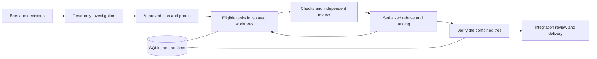

# Why ARC exists

ARC turns an ambitious coding request into bounded jobs, gives those jobs to
coding agents, and keeps a record of the goal, changes, reviews, and checks.
You should be able to leave a mission running and return to either verified
work or a specific explanation of what needs attention.

The original request was practical: use Claude and Codex subscriptions together,
give a capable head a messy brief, let both model families investigate it, then
have one model implement and another review. The head should ask questions that
change the work and keep the original requirements intact through a long run.

The recurring problems in the early sessions were:

- Long conversations lost requirements, repeated research, and became hard to audit.
- Separate sessions edited the same checkout and mixed up changes.
- Agents reported completion without adequate evidence.
- Overnight work stopped on capacity, sandbox, setup, or review failures.
- Useful commits survived on branches while the interface reported failure.
- Too much quota went to repeated attempts that could not fix the underlying problem.

The session comparisons in the original handoff found compaction in two long
sessions that degraded and none in a shorter session that held up. That supports
keeping durable state outside conversations; it does not establish that compaction
was the sole cause of the observed failures.

## Where the ideas came from

| Source | Useful contribution | ARC's adaptation |
| --- | --- | --- |
| outsourcerer | CLI dispatch, process supervision, failure vocabulary, worktrees | A typed, testable provider harness with bounded attempts and receipts |
| open-kritt | Focused agents, structured findings, independent validation | Evidence attached to coding tasks; dependent code changes require extra integration checks |
| session-master | Operational discipline for planning, gates, collision analysis, landing | Executable scheduling and integration rules instead of relying on a model to remember a playbook |

ARC was intentionally a new implementation. The distinct requirement is that
coding tasks depend on one another: independent branches can pass their own tests
and still conflict through an exported type, a schema, or an assumption.

## The product to keep building

The orchestration policy is ordinary code. SQLite stores the charter, plan,
attempts, decisions, findings, and evidence. Each agent gets a bounded brief
rebuilt from those records. The charter is included verbatim. The model can be
replaced without making its conversation the system of record.

A deep run follows this path:

Workers take eligible tasks as slots become available. Footprints, dependencies,
and declared contracts restrict concurrency. Completed branches land on an
integration branch. The final combined tree must pass project gates and the
command criteria of landed tasks before delivery.

The direct lane is useful for small changes in the current checkout. Its
checkpoint and independent review are valuable, but it does not provide the deep
lane's isolated branches and crash recovery. Use the deep lane for long work or
multiple simultaneous sessions.

## What security means here

ARC needs to withstand an agent being mistaken: overstating progress, editing
outside its task, writing a misleading check, or returning an inconsistent review.
It also needs to avoid exposing unrelated shell credentials and running supposedly
read-only commands with unexpected write access.

ARC is a local developer tool for trusted repositories. It is not a security
boundary for hostile repositories or mutually untrusted tenants. Project setup,
dependencies, hooks, approved proof commands, and provider tools can execute code.
Worktrees share Git metadata. See [the security model](security.md) before using
ARC for untrusted vulnerability samples or third-party repositories.

## Evidence used to reconstruct this purpose

This account was reconstructed on 2026-09-05 from local ARC session history,
repository code, tests, and these existing handoffs:

- The 2026-08-21 architecture discussion comparing outsourcerer, open-kritt, and session-master.
- The 2026-08-22 Codex session `01a02939`: the owner's original brief and correction that the build had lost its direction.
- Claude session `281b001d`: self-hosted runs, checkout collisions, UI requests, and the failed overnight campaigns.
- Claude session `6d347245`: the test-first and sandbox capability mismatch, followed by the capability design.
- [Unattended-run handoff](../HANDOFF-SOL.md), [v2 research](../HANDOFF-V2.md), [v2 decisions](../HANDOFF-V2-PLAN.md), and [v3 handoff](../HANDOFF-V3.md).

The historical handoffs contain proposals and claims that were later corrected.
They explain intent; current code and reproduced behavior determine what works.
